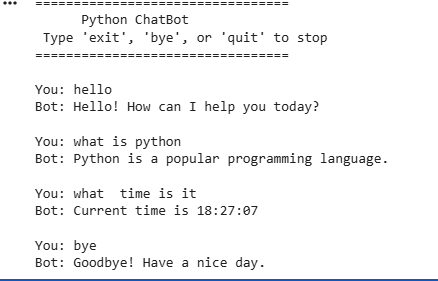

🤖 Python Chatbot
A simple rule-based chatbot built using Python that can interact with users, respond to greetings, answer basic questions, and display the current date and time.
This project was developed as part of the Python Programming Internship Task at CodeAlpha.
📌 Features
User-friendly chatbot interaction
Responds to greetings (hello, hi, hey)
Answers basic questions
Displays current time and date
Handles unknown questions
Exit commands (exit, bye, quit)
Uses Python functions, loops, dictionaries, and random module
🛠 Technologies Used
Python
Random Module
Datetime Module
📂 Project Structure

Python-Chatbot
│
├── chatbot.py        # Main Python chatbot program
├── README.md         # Project documentation
⚙️ Installation
Install Python on your system.
Clone this repository

git clone https://github.com/yourusername/python-chatbot.git
Navigate to the project folder

cd python-chatbot
Run the program

python chatbot.py
▶️ Example Output

Python ChatBot
Type 'exit', 'bye', or 'quit' to stop

You: hello
Bot: Hello! How can I help you today?

You: what is python
Bot: Python is a popular programming language.

You: what time is it
Bot: Current time is 18:30:12

You: bye
Bot: Goodbye! Have a nice day.
🚀 Future Improvements
Add GUI using Tkinter
Add voice recognition chatbot
Integrate AI NLP libraries
Add more conversational responses
📸 Project Demo
You can add screenshots here.

👩‍💻 Author
Tharuni
Python Programming Intern at
CodeAlpha
📄 License
This project is created for educational purposes as part of the CodeAlpha Internship Program.
